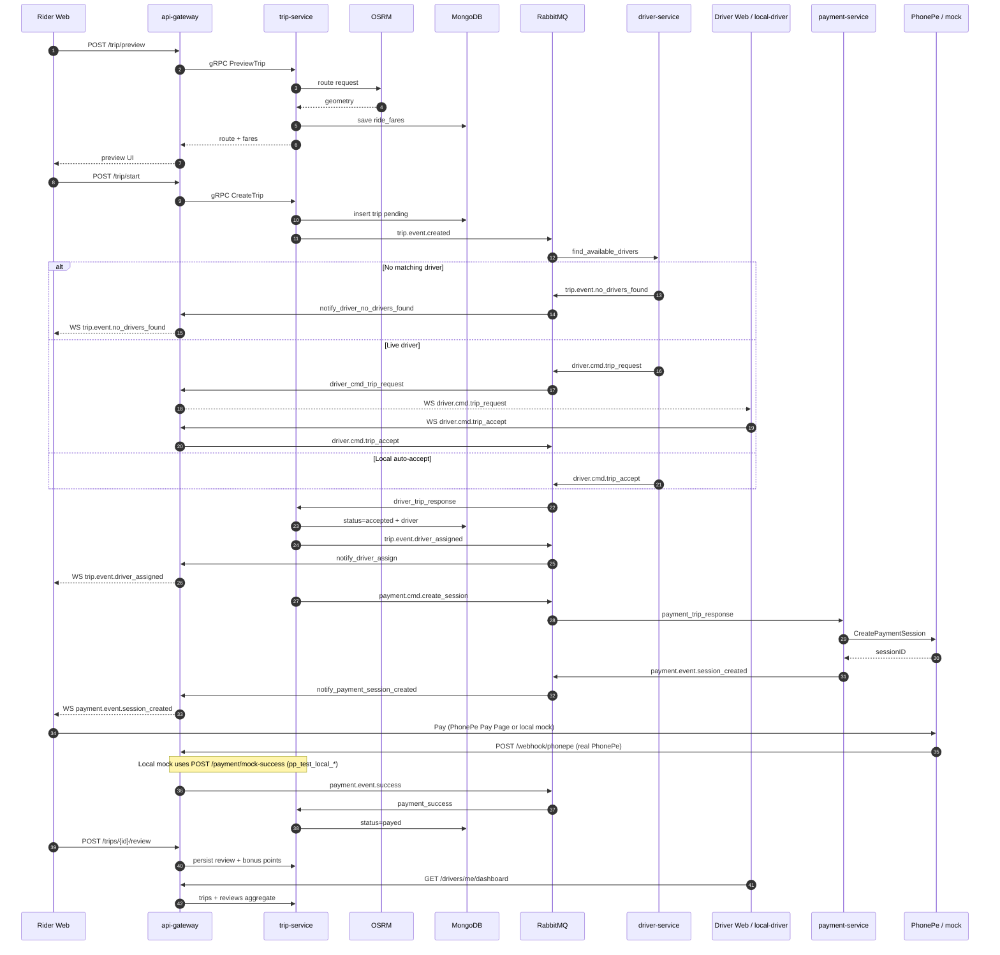

# Data & Event Flow (Code-Accurate)

This document is the **source of truth** for RabbitMQ topology and trip lifecycle messaging.  
Constants live in:

- `shared/contracts/amqp.go` — routing keys
- `shared/messaging/events.go` — queue names & payload structs
- `shared/messaging/rabbitmq.go` — exchange/queue bindings

> Older diagrams in `rabbitmq-flow-v1.md` use some names that do not match code. Prefer this file.

---

## 1. Messaging backbone

| Resource | Value |
|----------|-------|
| Primary exchange | `trip` (**topic**) |
| Dead-letter exchange | `dlx` |
| Dead-letter queue | `dead_letter_queue` (bound `#` on `dlx`) |
| Envelope | `contracts.AmqpMessage` `{ ownerId, data }` |

Publish API: `RabbitMQ.PublishMessage(ctx, routingKey, AmqpMessage)`.

---

## 2. Queue → routing key → consumer map

| Queue | Bound keys | Consumer |
|-------|------------|----------|
| `find_available_drivers` | `trip.event.created`, `trip.event.driver_not_interested` | driver-service |
| `driver_cmd_trip_request` | `driver.cmd.trip_request` | api-gateway → driver WS |
| `driver_trip_response` | `driver.cmd.trip_accept`, `driver.cmd.trip_decline` | trip-service |
| `notify_driver_no_drivers_found` | `trip.event.no_drivers_found` | api-gateway → rider WS |
| `notify_driver_assign` | `trip.event.driver_assigned` | api-gateway → rider WS |
| `notify_trip_lifecycle` | en_route, arrived, started, completed, cancelled, **otp_issued** | api-gateway → rider WS |
| `trip_lifecycle_update` | en_route, arrived, started, completed, cancelled | trip-service |
| `trip_otp_verify` | **`trip.cmd.verify_otp`**, **`trip.cmd.cancel`** | trip-service |
| `notify_driver_control` | otp_failed, otp_verified, cancelled, started | api-gateway → driver WS |
| `driver_sim_control` | otp_verified, cancelled, started | driver-service simulator |
| `payment_trip_response` | `payment.cmd.create_session` | payment-service |
| `notify_payment_session_created` | `payment.event.session_created` | api-gateway → rider WS |
| `payment_success` | `payment.event.success` | trip-service |

**OTP start gate:** plaintext OTP is only published on `trip.event.otp_issued` to the rider `ownerId`. The driver starts the trip with `trip.cmd.verify_otp`. Client-originated `trip.event.started` is ignored by trip-service and blocked by api-gateway.

**Payment:** created only after a valid `in_progress → completed` transition. Default provider is PhonePe (`PAYMENT_PROVIDER=phonepe`). Without `PHONEPE_MERCHANT_ID` / `PHONEPE_SALT_KEY`, payment-service mints `pp_test_local_*` sessions and the rider UI uses mock checkout via `POST /payment/mock-success`. Real PhonePe callbacks hit `POST /webhook/phonepe`. After pay, riders may `POST /trips/{id}/review` (bonus points = rating); drivers read aggregates via `GET /drivers/me/dashboard`.

---

## 3. End-to-end sequence (happy path)



---

## 4. Payload shapes

Published `data` is JSON (often nested inside `AmqpMessage.data` as bytes).

### Trip created / rematch
```json
{
  "trip": {
    "id": "...",
    "userID": "...",
    "status": "pending",
    "selectedFare": { "packageSlug": "sedan", "totalPriceInCents": 1829.3 },
    "route": { "geometry": [...], "distance": 964.7, "duration": 129 },
    "driver": {}
  }
}
```
Type: `messaging.TripEventData`

### Driver accept / decline
```json
{
  "tripID": "...",
  "riderID": "...",
  "driver": {
    "id": "local-driver-sedan",
    "name": "Lando Norris",
    "packageSlug": "sedan",
    "carPlate": "...",
    "profilePicture": "...",
    "location": { "latitude": 37.77, "longitude": -122.41 }
  }
}
```
Type: `messaging.DriverTripResponseData`

### Create payment session command
```json
{
  "tripID": "...",
  "userID": "...",
  "driverID": "...",
  "amount": 1829.3,
  "currency": "USD"
}
```
Type: `messaging.PaymentTripResponseData`

### Payment session created
```json
{
  "tripID": "...",
  "sessionID": "cs_test_local_...",
  "amount": 18.29,
  "currency": "USD"
}
```
Type: `messaging.PaymentEventSessionCreatedData`  
Note: amount is converted to dollars for the UI (`cents / 100`).

---

## 5. HTTP & WebSocket contracts (edge)

| Method / path | Client | Backend action |
|---------------|--------|----------------|
| `POST /trip/preview` | Rider | gRPC `PreviewTrip` |
| `POST /trip/start` | Rider | gRPC `CreateTrip` + publish created |
| `GET /ws/riders?userID=` | Rider | Subscribe notification queues |
| `GET /ws/drivers?userID=&packageSlug=` | Driver | Register gRPC + trip request queue |
| `POST /webhook/stripe` | Stripe | Verify signature → `payment.event.success` (rollback path) |
| `POST /webhook/phonepe` | PhonePe | Verify checksum → `payment.event.success` |
| `POST /payment/mock-success` | Rider UI | Accept `pp_test_local_*` / `cs_test_local_*` → success event |
| `POST /trips/{id}/review` | Rider | Persist rating/comment; award bonus points |
| `GET /drivers/me/dashboard` | Driver JWT | Trip count, bonus points, avg rating, recent trips/reviews |
| `GET /drivers/me/trips` | Driver JWT | Completed/payed trips for driver |

Frontend event names mirror routing keys (`web/src/contracts.ts` → `TripEvents`).

---

## 6. Local prototype shortcuts

| Flag | Effect |
|------|--------|
| `LOCAL_SEED_DRIVERS=true` | Registers `local-driver-{sedan,suv,van,luxury}` in memory |
| `LOCAL_AUTO_ACCEPT=true` | Seeded drivers publish `driver.cmd.trip_accept` immediately |
| `PAYMENT_PROVIDER=phonepe` (default) | Prefer PhonePe; use local `pp_test_local_*` when credentials missing |
| `PHONEPE_MERCHANT_ID` + `PHONEPE_SALT_KEY` empty | payment-service uses PhonePe mock sessions |
| `PAYMENT_PROVIDER=stripe` + `STRIPE_SECRET_KEY=*replace_me*` | Stripe mock sessions `cs_test_local_*` |

These let a **single rider tab** complete the flow without a second driver browser.
