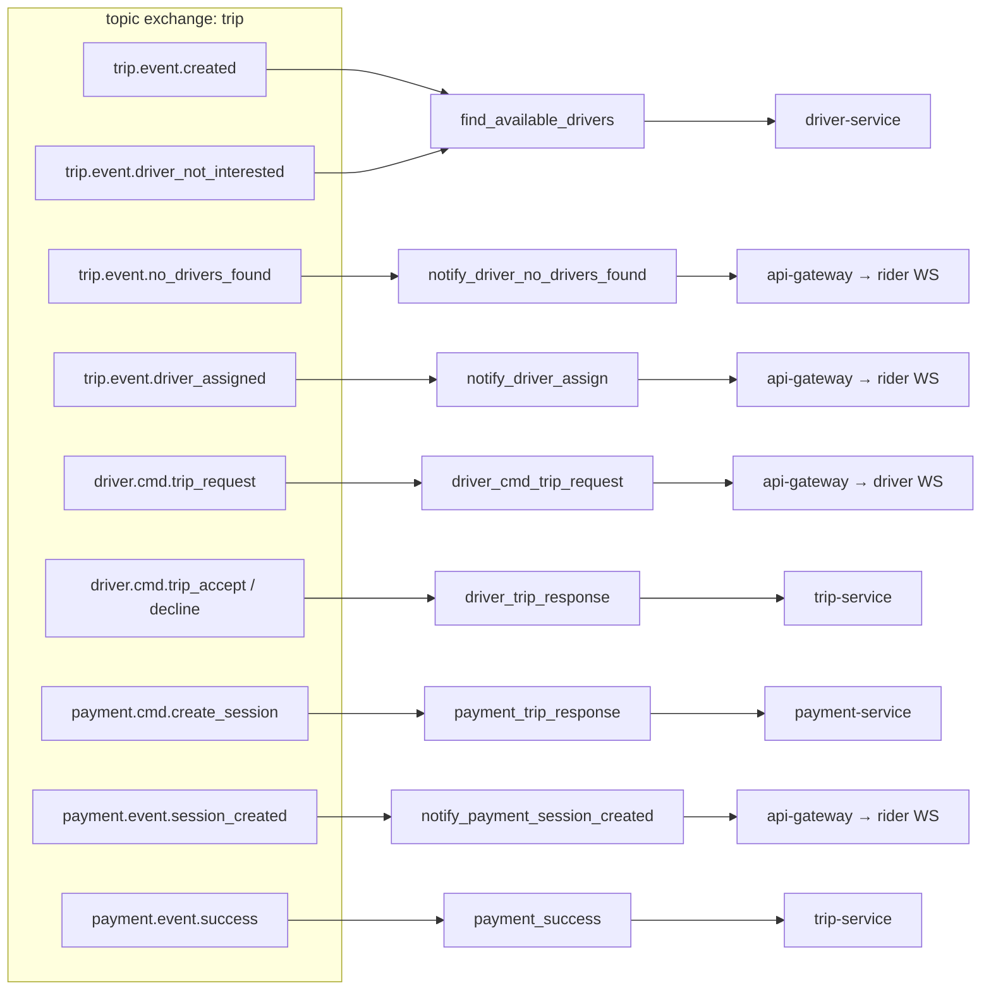

# Data & Event Flow (Code-Accurate)

This document is the **source of truth** for RabbitMQ topology and trip lifecycle messaging.  
Constants live in:

- `shared/contracts/amqp.go` — routing keys
- `shared/messaging/events.go` — queue names & payload structs
- `shared/messaging/rabbitmq.go` — exchange/queue bindings

> Older diagrams in `rabbitmq-flow-v1.md` use some names that do not match code. Prefer this file.

---

## 1. Messaging backbone

| Resource | Value |
|----------|-------|
| Primary exchange | `trip` (**topic**) |
| Dead-letter exchange | `dlx` |
| Dead-letter queue | `dead_letter_queue` (bound `#` on `dlx`) |
| Envelope | `contracts.AmqpMessage` `{ ownerId, data }` |

Publish API: `RabbitMQ.PublishMessage(ctx, routingKey, AmqpMessage)`.

---

## 2. Queue → routing key → consumer map



| Queue | Bound keys | Consumer |
|-------|------------|----------|
| `find_available_drivers` | `trip.event.created`, `trip.event.driver_not_interested` | driver-service |
| `driver_cmd_trip_request` | `driver.cmd.trip_request` | api-gateway → driver WS |
| `driver_trip_response` | `driver.cmd.trip_accept`, `driver.cmd.trip_decline` | trip-service |
| `notify_driver_no_drivers_found` | `trip.event.no_drivers_found` | api-gateway → rider WS |
| `notify_driver_assign` | `trip.event.driver_assigned` | api-gateway → rider WS |
| `payment_trip_response` | `payment.cmd.create_session` | payment-service |
| `notify_payment_session_created` | `payment.event.session_created` | api-gateway → rider WS |
| `payment_success` | `payment.event.success` | trip-service |

Declared but unused in bindings today: `payment.event.failed`, `payment.event.cancelled`.

---

## 3. End-to-end sequence (happy path)

```mermaid
sequenceDiagram
  autonumber
  participant R as Rider Web
  participant GW as api-gateway
  participant T as trip-service
  participant O as OSRM
  participant M as MongoDB
  participant Q as RabbitMQ
  participant D as driver-service
  participant Dr as Driver Web / local-driver
  participant P as payment-service
  participant S as Stripe / mock

  R->>GW: POST /trip/preview
  GW->>T: gRPC PreviewTrip
  T->>O: route request
  O-->>T: geometry
  T->>M: save ride_fares
  T-->>GW: route + fares
  GW-->>R: preview UI

  R->>GW: POST /trip/start
  GW->>T: gRPC CreateTrip
  T->>M: insert trip pending
  T->>Q: trip.event.created
  Q->>D: find_available_drivers

  alt No matching driver
    D->>Q: trip.event.no_drivers_found
    Q->>GW: notify_driver_no_drivers_found
    GW-->>R: WS trip.event.no_drivers_found
  else Live driver
    D->>Q: driver.cmd.trip_request
    Q->>GW: driver_cmd_trip_request
    GW-->>Dr: WS driver.cmd.trip_request
    Dr->>GW: WS driver.cmd.trip_accept
    GW->>Q: driver.cmd.trip_accept
  else Local auto-accept
    D->>Q: driver.cmd.trip_accept
  end

  Q->>T: driver_trip_response
  T->>M: status=accepted + driver
  T->>Q: trip.event.driver_assigned
  Q->>GW: notify_driver_assign
  GW-->>R: WS trip.event.driver_assigned

  T->>Q: payment.cmd.create_session
  Q->>P: payment_trip_response
  P->>S: CreatePaymentSession
  S-->>P: sessionID
  P->>Q: payment.event.session_created
  Q->>GW: notify_payment_session_created
  GW-->>R: WS payment.event.session_created

  R->>S: Pay (Checkout or local redirect)
  S->>GW: POST /webhook/stripe (real Stripe)
  Note over GW,T: Local mock skips webhook; UI goes to ?payment=success
  GW->>Q: payment.event.success
  Q->>T: payment_success
  T->>M: status=payed
```

---

## 4. Payload shapes

Published `data` is JSON (often nested inside `AmqpMessage.data` as bytes).

### Trip created / rematch
```json
{
  "trip": {
    "id": "...",
    "userID": "...",
    "status": "pending",
    "selectedFare": { "packageSlug": "sedan", "totalPriceInCents": 1829.3 },
    "route": { "geometry": [...], "distance": 964.7, "duration": 129 },
    "driver": {}
  }
}
```
Type: `messaging.TripEventData`

### Driver accept / decline
```json
{
  "tripID": "...",
  "riderID": "...",
  "driver": {
    "id": "local-driver-sedan",
    "name": "Lando Norris",
    "packageSlug": "sedan",
    "carPlate": "...",
    "profilePicture": "...",
    "location": { "latitude": 37.77, "longitude": -122.41 }
  }
}
```
Type: `messaging.DriverTripResponseData`

### Create payment session command
```json
{
  "tripID": "...",
  "userID": "...",
  "driverID": "...",
  "amount": 1829.3,
  "currency": "USD"
}
```
Type: `messaging.PaymentTripResponseData`

### Payment session created
```json
{
  "tripID": "...",
  "sessionID": "cs_test_local_...",
  "amount": 18.29,
  "currency": "USD"
}
```
Type: `messaging.PaymentEventSessionCreatedData`  
Note: amount is converted to dollars for the UI (`cents / 100`).

---

## 5. HTTP & WebSocket contracts (edge)

| Method / path | Client | Backend action |
|---------------|--------|----------------|
| `POST /trip/preview` | Rider | gRPC `PreviewTrip` |
| `POST /trip/start` | Rider | gRPC `CreateTrip` + publish created |
| `GET /ws/riders?userID=` | Rider | Subscribe notification queues |
| `GET /ws/drivers?userID=&packageSlug=` | Driver | Register gRPC + trip request queue |
| `POST /webhook/stripe` | Stripe | Verify signature → `payment.event.success` |

Frontend event names mirror routing keys (`web/src/contracts.ts` → `TripEvents`).

---

## 6. Local prototype shortcuts

| Flag | Effect |
|------|--------|
| `LOCAL_SEED_DRIVERS=true` | Registers `local-driver-{sedan,suv,van,luxury}` in memory |
| `LOCAL_AUTO_ACCEPT=true` | Seeded drivers publish `driver.cmd.trip_accept` immediately |
| `STRIPE_SECRET_KEY=*replace_me*` | payment-service uses mock sessions `cs_test_local_*` |

These let a **single rider tab** complete the flow without a second driver browser.
