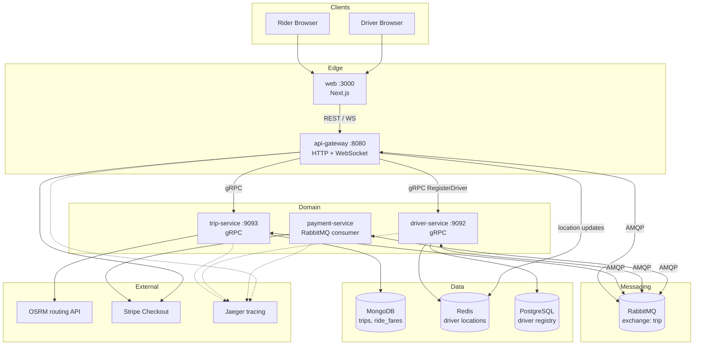

# System Overview — CloudPulse Architecture

## 1. What the system does

CloudPulse is an **Uber-style ride-sharing** application:

1. A **rider** picks pickup/destination on a map and previews fares.
2. The rider **starts a trip** for a chosen vehicle package (sedan / suv / van / luxury).
3. The platform **matches a driver** (live WebSocket driver or local auto-seeded drivers).
4. After accept, the rider gets a **payment session** (Stripe or local mock).
5. On successful payment, the trip is marked paid / complete.

---

## 2. High-level architecture



### Design style

| Layer | Pattern |
|-------|---------|
| Edge | API Gateway BFF — browser never talks to gRPC services directly |
| Sync calls | gRPC (gateway → trip / driver) |
| Async choreography | RabbitMQ **topic** exchange `trip` (events + commands) |
| Trip persistence | MongoDB |
| Real-time UI | WebSockets through api-gateway |
| Observability | OpenTelemetry → Jaeger |

---

## 3. Microservices at a glance

| Service | Runtime | Protocol | Responsibility |
|---------|---------|----------|----------------|
| **api-gateway** | Go | HTTP + WS | Auth-less edge, trip HTTP, WS fan-out, Stripe webhook |
| **trip-service** | Go | gRPC + AMQP | Preview route/fares, create trip, assign driver, mark paid |
| **driver-service** | Go | gRPC + AMQP | Register drivers, find by package, trip request / auto-accept |
| **payment-service** | Go | AMQP only | Create Stripe/local checkout session |
| **web** | Next.js | HTTP | Rider & driver maps, fare UI, payment button |

Detailed docs: [services/](../services/).

---

## 4. Communication matrix

| From → To | Mechanism | Purpose |
|-----------|-----------|---------|
| web → api-gateway | `POST /trip/preview`, `POST /trip/start` | Fare preview & trip create |
| web → api-gateway | `WS /ws/riders`, `WS /ws/drivers` | Live trip / payment / trip-request events |
| api-gateway → trip-service | gRPC `PreviewTrip`, `CreateTrip` | Sync trip domain |
| api-gateway → driver-service | gRPC `RegisterDriver`, `UnregisterDriver` | Driver online/offline |
| trip-service → MongoDB | Driver | Persist trips & fares |
| trip-service → OSRM | HTTPS | Real road geometry |
| \* → RabbitMQ | AMQP publish/consume | Match, assign, pay |
| Stripe → api-gateway | `POST /webhook/stripe` | Payment completed |

Full routing keys & queues: [data-flow.md](./data-flow.md).

---

## 5. Deployment views

### Local prototype (`docker-compose`)

```
Browser :3000 → web → api-gateway :8080
                      ├─ trip-service :9093 + mongo :27017
                      ├─ driver-service :9092
                      ├─ payment-service
                      └─ rabbitmq :5672 / :15672
jaeger :16686   redis :6379 (driver locations)   postgres :5432 (driver registry)
```

Start: `docker compose up --build`  
Guide: [simulation/local-e2e-test.md](../simulation/local-e2e-test.md)

### Production (AWS)

```
Route53 → ALB (Ingress)
            ├─ cloudpulse.live     → frontend pods
            └─ api.cloudpulse.live → backend (api-gateway) pods + HPA
EKS (private nodes + NAT) ← Terraform
GitOps: Docker Hub images → values-production.yaml → ArgoCD sync
```

---

## 6. Trust boundaries & security notes

- Browsers only reach **web** and **api-gateway** (via ALB in prod).
- Internal gRPC ports (`9092`, `9093`) stay on the cluster network.
- MongoDB / RabbitMQ / Redis / Postgres are private-subnet only in Terraform.
- Stripe secrets via env / K8s Secrets; webhook signature verified when key set.
- Local Docker uses placeholder Stripe keys → **mock payment processor**.

---

## 7. What is “reserved” vs live

| Component | Status |
|-----------|--------|
| MongoDB | **Live** — trip & fare storage |
| RabbitMQ | **Live** — all async flows |
| Jaeger | **Live** — tracing exporters configured |
| Redis | **Live** — driver location tracking (driver-service + api-gateway); ElastiCache in AWS |
| PostgreSQL | **Live** — driver registry persistence (driver-service); RDS in AWS |
| Stripe | **Live or mock** depending on `STRIPE_SECRET_KEY` |

---

## 8. Related diagrams

- Sequence (product flow): [trip-creation-flow-v1.md](./trip-creation-flow-v1.md)
- Code-accurate events: [data-flow.md](./data-flow.md)
- GitOps pipeline: [`gitops/README.md`](../../gitops/README.md)
