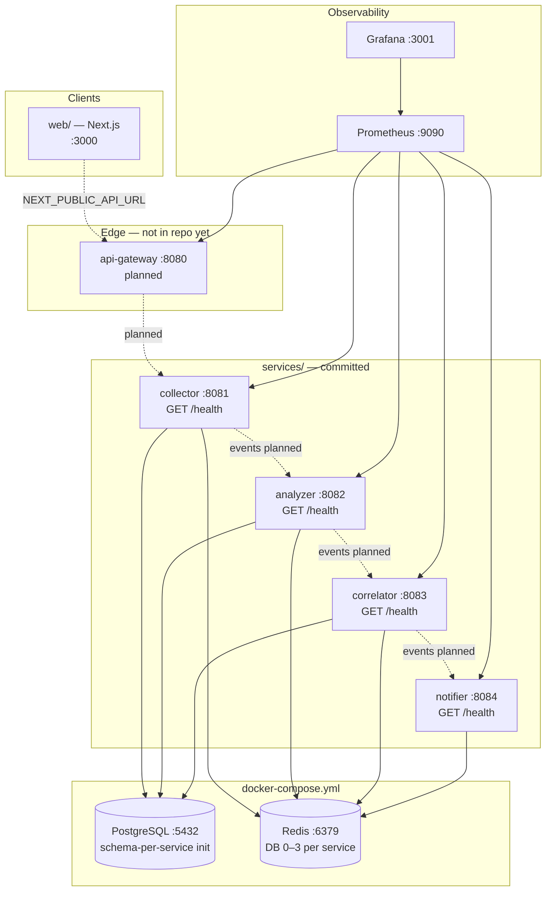
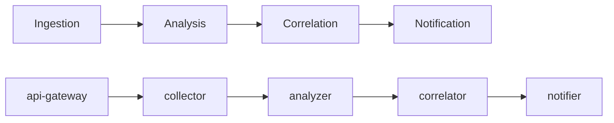
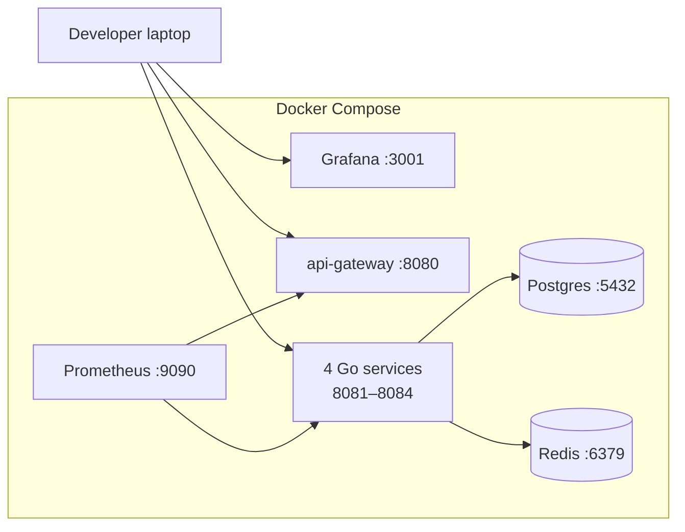
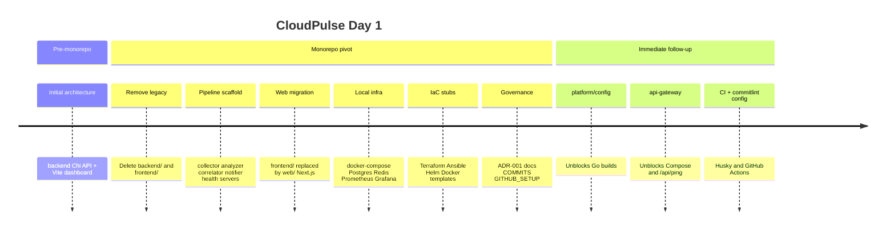

# CloudPulse — Day 1 Engineering Log

**Date:** Day 1 (foundation sprint)  
**Author:** Durga Prasad Raju Nadimpalli  
**Commit:** `a4ba10c` — `chore(infra): scaffold CloudPulse monorepo for Day 1`  
**Status:** Monorepo scaffold committed — `platform/config` and `api-gateway` still required before `docker compose up --build` succeeds

This document records what is **actually in the repository** after Day 1: the microservices pipeline skeleton, Next.js web shell, Docker Compose stack, infrastructure stubs, and governance docs. It replaces the earlier aspirational draft that listed components not yet committed.

---

## 1. Executive summary

Day 1 pivoted CloudPulse from a **Gin monolith + Vite SPA** (`backend/`, `frontend/`) to a **microservices monorepo** aligned with [ADR-001](../adr/ADR-001-microservices-and-database-strategy.md).

### What was delivered (in repo)

| Area | Day 1 deliverable |
|------|-------------------|
| **Pipeline services** | Four Go health servers: `collector`, `analyzer`, `correlator`, `notifier` |
| **Web** | Next.js 15 app in `web/` (replaces legacy Vite `frontend/`) |
| **Local infra** | `docker-compose.yml` — Postgres, Redis, Prometheus, Grafana |
| **IaC stubs** | Terraform, Ansible, Helm chart skeleton under `infra/` |
| **Governance** | ADR-001, commit conventions (`docs/COMMITS.md`), GitHub setup guide |
| **Tooling** | Root `package.json` with commitlint devDependencies; `go.work` workspace |

### What is referenced but not yet in repo

| Path | Referenced by | Phase 2 action |
|------|---------------|----------------|
| `platform/config/` | All service `main.go`, Dockerfiles, `go.work` | Add shared env + CORS loader |
| `services/api-gateway/` | `docker-compose.yml`, `go.work`, Helm, Prometheus | HTTP edge, JWT, `/api/ping` |
| `.commitlintrc.json`, `.husky/` | `package.json`, `docs/COMMITS.md` | Wire conventional commits |
| `.github/workflows/ci.yml` | — | Build services + web on push |
| `proto/`, `packages/types/` | ADR-001 target design | gRPC contracts + shared TS types |

### What was removed in Day 1 commit

The prior architecture commit (`c815d52`) contained `backend/` (Chi/Gin API) and `frontend/` (Vite + Tailwind dashboard). Both were **deleted** when the monorepo scaffold landed. Their behavior is summarized in [§9 Legacy architecture](#9-legacy-architecture-pre-day-1-monorepo).

---

## 2. Architecture diagrams

### 2.1 Current repository layout (Day 1 committed)



Solid boxes = committed code. Dashed boxes = planned or referenced but missing from the tree.

### 2.2 Target pipeline (ADR-001)



Day 1 implements **health endpoints only** on the four pipeline services. Event flow via Redis is configured in Compose env vars but not implemented in Go code yet.

### 2.3 Local Docker Compose topology



---

## 3. Repository layout (actual tree)

```
CloudPulse/
├── docker-compose.yml          # Postgres, Redis, Prometheus, Grafana + 5 Go services
├── go.work                     # Links platform/config + 5 service modules
├── package.json                # commitlint devDependencies (root)
├── services/
│   ├── collector/              # ✅ committed — health server :8081
│   ├── analyzer/               # ✅ committed — health server :8082
│   ├── correlator/             # ✅ committed — health server :8083
│   ├── notifier/               # ✅ committed — health server :8084
│   └── api-gateway/            # ❌ missing — referenced by compose & go.work
├── web/                        # ✅ Next.js 15 app
├── infra/
│   ├── docker/                 # Dockerfile template, Postgres init, Prometheus, Grafana
│   ├── terraform/              # AWS provider stub
│   ├── ansible/                # Docker bootstrap stub
│   └── helm/cloudpulse/        # Chart + api-gateway Deployment template
└── docs/
    ├── day1/README.md          # this file
    ├── adr/ADR-001-*.md
    ├── COMMITS.md
    └── GITHUB_SETUP.md
```

| Path | Status | Purpose |
|------|--------|---------|
| `services/collector` | **Committed** | Ingestion service scaffold; `GET /health` |
| `services/analyzer` | **Committed** | Analysis service scaffold; `GET /health` |
| `services/correlator` | **Committed** | Correlation service scaffold; `GET /health` |
| `services/notifier` | **Committed** | Notification service scaffold; `GET /health` |
| `services/api-gateway` | **Missing** | HTTP edge — required by Compose |
| `platform/config` | **Missing** | Shared Go env loader — required by all services |
| `web/` | **Committed** | Next.js shell for Vercel (`app.cloudpulse.live` target) |
| `infra/` | **Committed** | Terraform, Ansible, Helm, Docker assets (stubs) |
| `backend/` | **Removed** | Former Gin/Chi monolith (see §9) |
| `frontend/` | **Removed** | Former Vite SPA (see §9) |
| `apps/` | **Never committed** | Module Federation MFEs — Phase 2 |
| `proto/`, `packages/` | **Never committed** | gRPC + shared TS types — Phase 2 |

---

## 4. Component inventory

### 4.1 Go microservices (`services/`)

All four committed services share the same Day 1 pattern:

- Import `github.com/durgaprasadraju/CloudPulse/platform/config` (module not in repo)
- Load global config via `platformcfg.Load()`
- Expose `GET /health` returning JSON `{"status":"ok","service":"<name>"}`
- Listen on `PORT` env (defaults 8081–8084)
- Multi-stage Alpine Dockerfile copying `platform/config` + service module

| Service | Port | Env vars (Compose) | Day 1 code | Future role |
|---------|------|--------------------|------------|-------------|
| **collector** | 8081 | `DATABASE_URL`, `REDIS_URL` (db 0) | Health only | URL/metric ingestion; publish events to Redis |
| **analyzer** | 8082 | `DATABASE_URL`, `REDIS_URL` (db 1) | Health only | Consume collector events; SLO rollups |
| **correlator** | 8083 | `DATABASE_URL`, `REDIS_URL` (db 2) | Health only | Incident graphs; dedupe alerts |
| **notifier** | 8084 | `REDIS_URL` (db 3), SMTP/Slack placeholders | Health only | Slack/email/webhooks; outbox via Redis |
| **api-gateway** | 8080 | `ALLOWED_ORIGINS`, `PUBLIC_*` URLs | **Not in repo** | JWT, CORS, `/api/ping`, route to gRPC |

**Key files per service (identical structure):**

| File | Purpose |
|------|---------|
| `cmd/<service>/main.go` | HTTP server, `/health` handler |
| `go.mod` | Module path + `replace` to `../../platform/config` |
| `Dockerfile` | Multi-stage build (Go 1.22 builder → Alpine 3.20) |
| `.env.example` | Local env template |

**Example — collector health handler:**

```go
mux.HandleFunc("/health", func(w http.ResponseWriter, _ *http.Request) {
    w.Header().Set("Content-Type", "application/json")
    _, _ = w.Write([]byte(`{"status":"ok","service":"collector"}`))
})
```

**Dependency chain in Compose:** `postgres` + `redis` → `api-gateway` + `collector` → `analyzer` → `correlator` → `notifier`.

---

### 4.2 Next.js web (`web/`)

Replaces the removed Vite `frontend/`. Minimal landing page with a link to the API heartbeat endpoint.

| File | Purpose |
|------|---------|
| `app/page.tsx` | Home page; displays `NEXT_PUBLIC_API_URL`; link to `/api/ping` |
| `app/layout.tsx` | Root layout, metadata (`CloudPulse`) |
| `next.config.ts` | Exposes `NEXT_PUBLIC_API_URL` (default `http://localhost:8080`) |
| `.env.development` | `NEXT_PUBLIC_API_URL=http://localhost:8080` |
| `.env.production` | `NEXT_PUBLIC_API_URL=https://api.cloudpulse.live` |
| `.env.example` | Same as development default |
| `package.json` | Next 15, React 19, TypeScript 5 |

**Run locally:**

```bash
cd web && npm install && npm run dev   # http://localhost:3000
```

The heartbeat link targets `api-gateway` (`/api/ping`), which is not implemented until `services/api-gateway` is added.

---

### 4.3 Infrastructure (`infra/`)

| Component | Path | Day 1 contents |
|-----------|------|----------------|
| **Go service template** | `docker/Dockerfile.go-service` | Multi-stage build with `ARG SERVICE`; copies `platform/config` |
| **Postgres init** | `docker/init-db/01_schemas.sql` | Extensions + schemas: `collector`, `analyzer`, `correlator`, `gateway` |
| **Prometheus** | `docker/prometheus/prometheus.yml` | Scrapes `api-gateway:8080` and services `:8081–8084` |
| **Grafana** | `docker/grafana/provisioning/datasources/prometheus.yml` | Prometheus datasource |
| **Terraform** | `terraform/main.tf` | AWS provider stub; output placeholder |
| **Terraform vars** | `terraform/variables.tf` | `aws_region`, `environment` |
| **Ansible** | `ansible/playbook.yml` | Docker package + compose deploy placeholder |
| **Helm** | `helm/cloudpulse/` | Chart v0.1.0; values for all 5 services; api-gateway Deployment template |

---

### 4.4 Root orchestration

| File | Purpose |
|------|---------|
| `docker-compose.yml` | Postgres 16, Redis 7, Prometheus, Grafana + api-gateway + 4 pipeline services |
| `go.work` | Go 1.25 workspace: `platform/config`, `api-gateway`, collector, analyzer, correlator, notifier |
| `package.json` | Root commitlint scripts (`commitlint`, `commitlint:last`) |

**Not present (despite earlier docs or commit message references):**

- `.commitlintrc.json`, `.husky/commit-msg`
- `.github/workflows/ci.yml`
- Root `.env.example`, `.gitignore`

---

## 5. Networking & environment

### 5.1 URL map

| Environment | Web origin | API base (`NEXT_PUBLIC_API_URL`) |
|-------------|------------|----------------------------------|
| **Development** | `http://localhost:3000` | `http://localhost:8080` |
| **Production** | `https://app.cloudpulse.live` (target) | `https://api.cloudpulse.live` |

Compose sets `ALLOWED_ORIGINS: http://localhost:3000,http://localhost:5173` on api-gateway (when added).

### 5.2 Service environment variables

| Service | Key variables |
|---------|---------------|
| All | `ENV=dev`, `PORT` |
| collector | `DATABASE_URL`, `REDIS_URL=redis://redis:6379/0` |
| analyzer | `DATABASE_URL`, `REDIS_URL=redis://redis:6379/1` |
| correlator | `DATABASE_URL`, `REDIS_URL=redis://redis:6379/2` |
| notifier | `REDIS_URL=redis://redis:6379/3`, `SMTP_*`, `SLACK_WEBHOOK_URL` |
| api-gateway (planned) | `ALLOWED_ORIGINS`, `PUBLIC_API_URL`, `PUBLIC_APP_URL`, `JWT_SECRET` |

### 5.3 Postgres (dev)

- User / password / database: `CloudPulse`
- Port: `5432`
- Schemas created on first boot via `infra/docker/init-db/01_schemas.sql`

---

## 6. Database strategy (ADR-001 summary)

See [ADR-001](../adr/ADR-001-microservices-and-database-strategy.md).

| Decision | Choice |
|----------|--------|
| Topology | Microservices over monolith |
| Primary DB | PostgreSQL — schema-per-service in dev |
| Queue | Redis between pipeline stages (env wired; consumers not implemented) |
| Pattern | Repository interface planned per service — not yet in Day 1 code |

| Service | Dev schema | Day 1 DB usage |
|---------|------------|----------------|
| collector | `collector` | Env set; no migrations yet |
| analyzer | `analyzer` | Env set; no migrations yet |
| correlator | `correlator` | Env set; no migrations yet |
| api-gateway | `gateway` | Schema created; service missing |
| notifier | — | Redis only in Compose |

---

## 7. What works vs what is blocked

| Capability | Day 1 (repo) | Blocker / next step |
|------------|--------------|---------------------|
| `GET /health` on pipeline services | Code written | Needs `platform/config` module to build |
| `docker compose up --build` | Compose file ready | Missing `api-gateway` + `platform/config` |
| `GET /api/ping` | Not implemented | Add `api-gateway` or temporary stub |
| Monitor CRUD | Not started | Repository pattern in Phase 2 |
| JWT auth | Not started | api-gateway middleware |
| Prometheus/Grafana | Containers + scrape config | Services must be running |
| Terraform / Helm | Stubs only | AWS EKS + RDS modules |
| Conventional commits | `package.json` deps only | Add `.commitlintrc.json` + husky |
| CI | Not present | Add `.github/workflows/ci.yml` |

---

## 8. How to run

### Prerequisites

Add these before the full stack builds:

1. **`platform/config`** — shared Go module with `Load()` returning env, allowed origins, public URLs
2. **`services/api-gateway`** — HTTP server on `:8080` with at least `/health` and `/api/ping`

### Full stack (after prerequisites)

```bash
docker compose up --build

# Endpoints (when all services run)
# Health:       http://localhost:8081/health  (collector)
#               http://localhost:8082/health  (analyzer)
#               http://localhost:8083/health  (correlator)
#               http://localhost:8084/health  (notifier)
# API gateway:  http://localhost:8080/health  (when added)
# Grafana:      http://localhost:3001  (admin / admin)
# Prometheus:   http://localhost:9090
```

### Web only (works today)

```bash
cd web && npm install && npm run dev   # http://localhost:3000
```

### Go workspace (after `platform/config` exists)

```bash
go work sync
cd services/collector && go run ./cmd/collector
```

---

## 9. Legacy architecture (pre-Day 1 monorepo)

Commit `c815d52` (`chore: initial project architecture`) contained a working monolith stack that Day 1 removed.

### `backend/` (removed)

| File | Purpose |
|------|---------|
| `internal/server/server.go` | Chi router, CORS, middleware |
| `internal/handler/health.go` | Health JSON responses |
| `internal/config/config.go` | `PORT`, `ENV`, `ALLOWED_ORIGINS` |
| `pkg/response/response.go` | Shared response helpers |

The Vite frontend called `GET /api/v1/health` (not `/api/ping`).

### `frontend/` (removed → migrated to `web/`)

| File | Purpose |
|------|---------|
| `src/App.tsx` | Fetched health API, displayed status |
| `vite.config.ts` | Dev server + API proxy |
| Tailwind + ESLint toolchain | Full SPA styling |

Day 1 replaced this with a minimal Next.js page; rich UI returns in Phase 2.

---

## 10. Day 1 timeline



---

## 11. Phase 2 recommendations

1. **Commit `platform/config`** — `Load()` with `ENV`, `ALLOWED_ORIGINS`, `PUBLIC_API_URL`, `PUBLIC_APP_URL` via godotenv + `os.Getenv`.
2. **Commit `services/api-gateway`** — Gin or stdlib HTTP; CORS from platform config; `GET /health`, stub `GET /api/ping`; JWT middleware skeleton.
3. **Restore CI** — `.github/workflows/ci.yml` building all Go modules + `web/`; `.commitlintrc.json` + husky hook.
4. **Implement collector → notifier pipeline** — Redis pub/sub or streams between services.
5. **Add `proto/`** — `buf generate`; wire api-gateway → pinger/collector gRPC.
6. **Deploy `web/`** to Vercel; api-gateway behind `api.cloudpulse.live` on AWS.
7. **Reintroduce observability UI** — latency charts, monitor CRUD (port ideas from removed `frontend/`).

---

## 12. Related documents

| Document | Description |
|----------|-------------|
| [ADR-001](../adr/ADR-001-microservices-and-database-strategy.md) | Microservices vs monolith, DB strategy |
| [COMMITS.md](../COMMITS.md) | Conventional commit format |
| [GITHUB_SETUP.md](../GITHUB_SETUP.md) | Push, branch protection, Vercel |
| [docs/README.md](../README.md) | Monorepo index |
| [README.md](../../README.md) | Root quick start |

---

*Apache License 2.0 — Copyright 2026 Durga Prasad Raju Nadimpalli*
