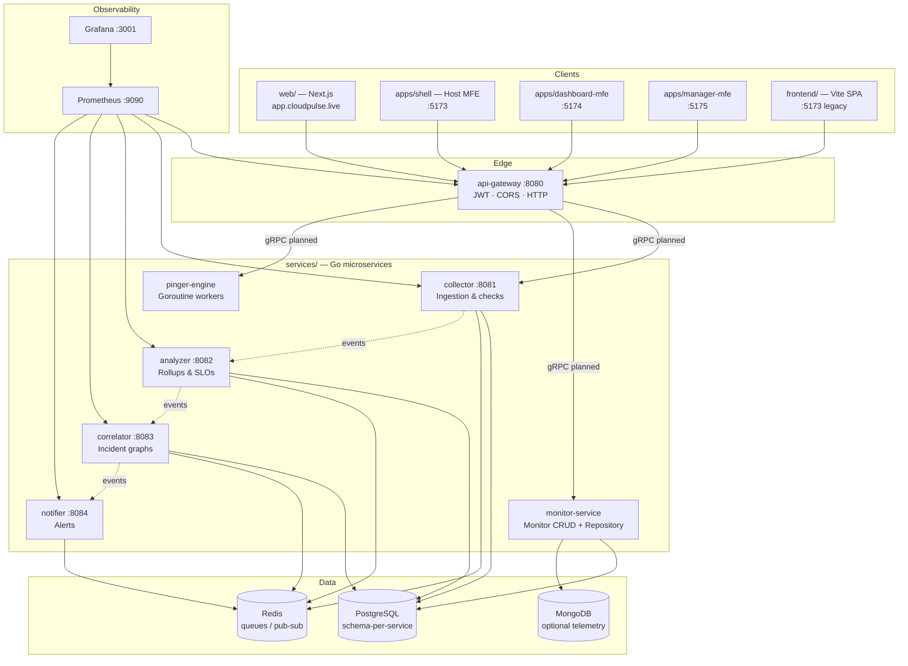
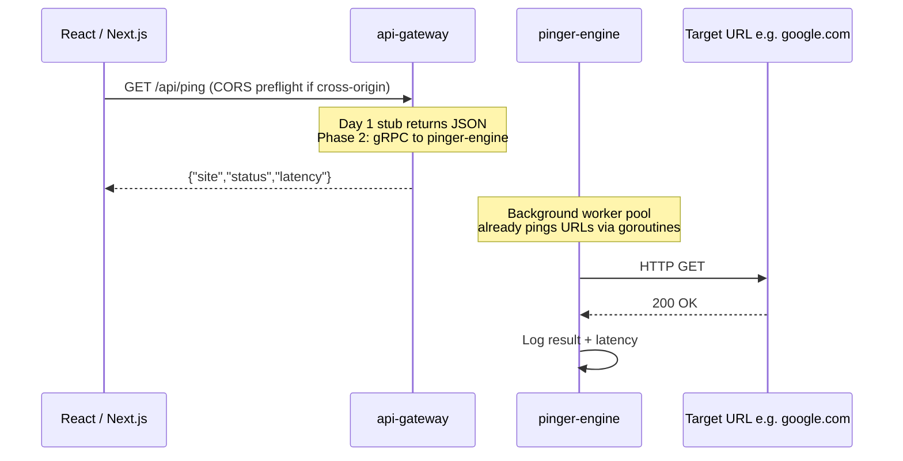
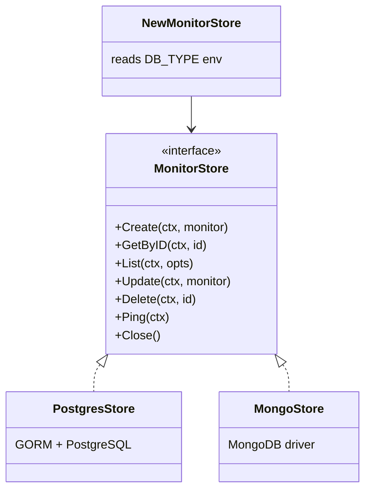
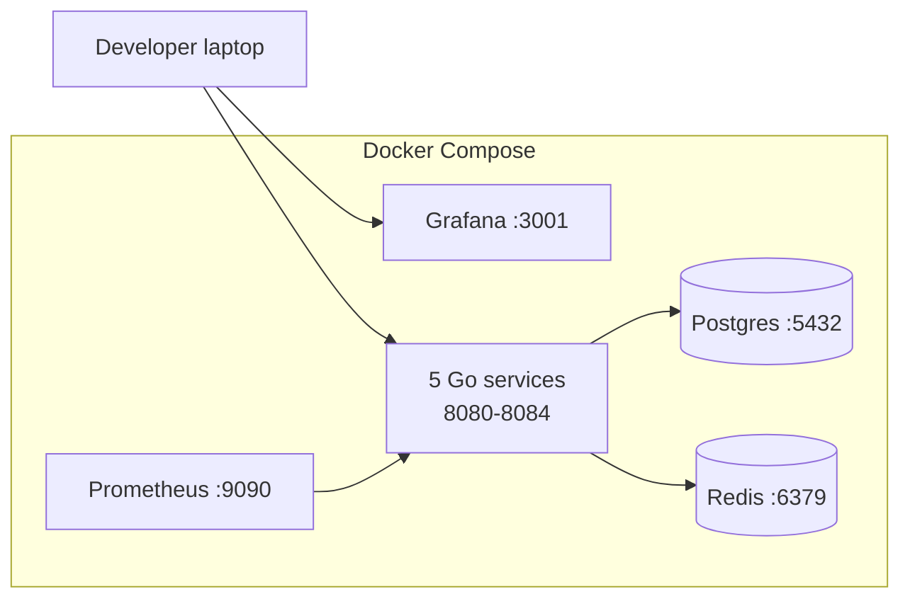
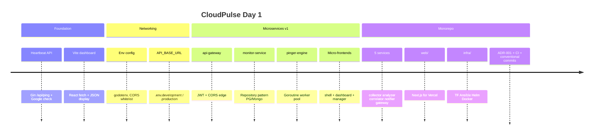

# CloudPulse — Day 1 Engineering Log

**Date:** Day 1 (foundation sprint)  
**Author:** Durga Prasad Raju Nadimpalli  
**Status:** Scaffold complete — ready for Phase 2 (gRPC, real ingestion, Vercel/AWS deploy)

This document records everything built on Day 1: the heartbeat prototype, networking layer, first microservices, micro-frontends, monorepo layout, infrastructure stubs, and governance tooling. It is the onboarding guide for anyone joining the project.

---

## 1. Executive summary

Day 1 established CloudPulse as an **observability platform** with:

1. A working **heartbeat** (`GET /api/ping`) that checks URL uptime and latency.
2. **Environment-aware networking** (localhost dev vs `cloudpulse.live` production).
3. A **microservices topology** aligned to bounded contexts: ingest → analyze → correlate → notify, behind an API gateway.
4. **Repository pattern** for database flexibility (PostgreSQL / MongoDB).
5. **Micro-frontends** (Vite Module Federation) and a **Next.js** web shell for Vercel.
6. **Docker Compose** with Postgres, Redis, Prometheus, and Grafana.
7. **ADR-001**, conventional commits, and CI workflow.

Day 1 code is intentionally **scaffold-first**: health endpoints, config patterns, and interfaces are real; gRPC wiring, production auth, and full CRUD are Phase 2.

---

## 2. Architecture diagrams

### 2.1 High-level system (target state)



### 2.2 Day 1 data flow — heartbeat



### 2.3 Repository pattern (monitor-service)



### 2.4 Deployment topology (local Day 1)



---

## 3. Repository layout (Day 1)

| Path | Day 1 status | Purpose |
|------|--------------|---------|
| `services/` | **Primary** | Go microservices (`go.work`) |
| `web/` | **Created** | Next.js app for Vercel (`app.cloudpulse.live`) |
| `infra/` | **Stubs** | Terraform, Ansible, Helm, Docker assets |
| `docs/` | **Created** | ADRs, Day 1 log, GitHub setup |
| `platform/config/` | **Designed** | Shared Go env + CORS (referenced by services) |
| `packages/types/` | **Designed** | Shared TypeScript `Monitor`, `PingResult` |
| `proto/` | **Designed** | gRPC contracts for monitor & pinger |
| `backend/` | **Legacy** | Original Gin monolith (`/api/ping`) |
| `frontend/` | **Legacy** | Original Vite + Tailwind dashboard |
| `apps/` | **Legacy MFE** | Shell + dashboard + manager (Module Federation) |

> **Note:** The Day 1 git commit includes the monorepo scaffold (`collector`, `analyzer`, `correlator`, `notifier`, `web`, `infra`). Legacy paths (`backend/`, `frontend/`, `apps/`, `api-gateway`, `platform/`) were built in the same sprint and should be merged into the repo on the next commit.

---

## 4. Component inventory

### 4.1 Go microservices (`services/`)

| Service | Port | Day 1 implementation | Future use |
|---------|------|------------------------|------------|
| **api-gateway** | 8080 | Gin HTTP server, CORS from `platform/config`, JWT middleware, `GET /health`, `GET /api/ping` (stub), protected `GET /api/monitors` (501) | Single public edge on AWS ALB; routes to internal gRPC; rate limiting; API keys |
| **collector** | 8081 | Health server; loads global config; env for Postgres + Redis | Schedule URL/metric ingestion; publish raw events to Redis; persist cursors in `collector` schema |
| **analyzer** | 8082 | Health server | Consume collector events; compute rollups, SLO breaches; write to `analyzer` schema |
| **correlator** | 8083 | Health server | Build incident graphs from analyzer signals; dedupe alerts |
| **notifier** | 8084 | Health server | Deliver Slack/email/webhooks; outbox pattern via Redis |
| **monitor-service** | 8081* | `MonitorStore` interface; GORM Postgres + Mongo implementations; `DB_TYPE` runtime switch | CRUD for monitors; gRPC server per `proto/monitor/v1` |
| **pinger-engine** | — | Goroutine worker pool (`worker.Pool`); demo Google ping | High-concurrency checks; fed by Redis queue; gRPC per `proto/pinger/v1` |

\*Port conflict with collector in target architecture — **Phase 2** will merge monitor CRUD into collector or reassign ports.

**Key files (api-gateway):**

| File | Purpose |
|------|---------|
| `cmd/api-gateway/main.go` | HTTP routes, CORS, server bootstrap |
| `internal/middleware/jwt.go` | Bearer JWT validation for `/api/*` |
| `Dockerfile` | Multi-stage Go build |
| `.env.example` | `JWT_SECRET`, gRPC upstream URLs, CORS |

**Key files (monitor-service — Repository pattern):**

| File | Purpose |
|------|---------|
| `internal/store/repository.go` | `MonitorStore` interface + `NewMonitorStore()` factory |
| `internal/store/postgres_store.go` | GORM implementation, auto-migrate |
| `internal/store/mongo_store.go` | MongoDB driver implementation |
| `internal/models/monitor.go` | Domain entity (`Monitor`, `MonitorStatus`) |
| `internal/store/errors.go` | `ErrNotFound` |

**Key files (pinger-engine):**

| File | Purpose |
|------|---------|
| `internal/worker/pool.go` | Bounded goroutine pool, job queue, HTTP check runner |
| `cmd/pinger-engine/main.go` | Starts pool, demo job to `https://google.com` |

---

### 4.2 Shared platform (`platform/config`)

| Concern | Day 1 behavior | Future use |
|---------|----------------|------------|
| `ENV` | `dev` / `prod` | Feature flags, log levels |
| `ALLOWED_ORIGINS` | Whitelist for CORS | Vercel previews, subdomains |
| `PUBLIC_API_URL` | `localhost:8080` or `api.cloudpulse.live` | Service discovery docs |
| `PUBLIC_APP_URL` | `localhost:3000` or `app.cloudpulse.live` | Redirect URIs, email links |

Loaded via `godotenv` + `os.Getenv` in every Go service.

---

### 4.3 Legacy monolith (`backend/`)

Built first on Day 1 to prove the heartbeat quickly.

| File | Purpose |
|------|---------|
| `main.go` | Gin server, `GET /api/ping`, real `net/http` check to Google |
| `internal/config/config.go` | `PORT`, `ENV`, `ALLOWED_ORIGINS` via godotenv |
| `internal/server/server.go` | Chi router variant (alternate entry) |
| `internal/handler/health.go` | Health JSON responses |
| `.env.example` | Local env template |

**Future:** Deprecated once api-gateway + pinger-engine gRPC path is complete. Keep for local smoke tests during migration.

---

### 4.4 Frontends

#### A. Legacy Vite SPA (`frontend/`)

| File | Purpose |
|------|---------|
| `src/App.tsx` | Fetches `API_BASE_URL/api/ping`, displays JSON |
| `src/config/api.ts` | `VITE_API_BASE_URL` constant |
| `.env.development` | `http://localhost:8080` |
| `.env.production` | `https://api.cloudpulse.live` |
| `vite.config.ts` | Dev proxy `/api` → `:8080` |

**Future:** Retire after `web/` reaches feature parity.

#### B. Micro-frontends (`apps/`)

| App | Port | Exposes / consumes | Future use |
|-----|------|-------------------|------------|
| **shell** | 5173 | Host; loads remotes | Auth shell, sidebar, layout on Vercel |
| **dashboard-mfe** | 5174 | Exposes `./App` — ping charts | Real-time latency charts, Grafana embeds |
| **manager-mfe** | 5175 | Exposes `./App` — monitor list | CRUD, Excel import |

Configured with `@originjs/vite-plugin-federation` in each `vite.config.ts`.

#### C. Next.js (`web/`)

| File | Purpose |
|------|---------|
| `app/page.tsx` | Landing + link to `/api/ping` |
| `app/layout.tsx` | Root layout, metadata |
| `next.config.ts` | `NEXT_PUBLIC_API_URL` |
| `.env.production` | `https://api.cloudpulse.live` |

**Future:** Primary production UI on Vercel at `app.cloudpulse.live`.

---

### 4.5 Shared types (`packages/types`)

| Type | Fields | Used by |
|------|--------|---------|
| `Monitor` | id, name, url, intervalSeconds, status | manager-mfe, future API clients |
| `PingResult` | site, status, latency | dashboard-mfe, shell |
| `CreateMonitorInput` / `UpdateMonitorInput` | CRUD DTOs | manager-mfe forms |

**Future:** Publish as internal npm package; OpenAPI codegen alignment.

---

### 4.6 gRPC contracts (`proto/`)

| Proto | Service | Day 1 status |
|-------|---------|--------------|
| `monitor/v1/monitor.proto` | `MonitorService` CRUD | Defined, not generated |
| `pinger/v1/pinger.proto` | `PingerService.RunCheck` | Defined, not generated |

**Future:** `buf generate` → `gen/`; internal only (not exposed to browser).

---

### 4.7 Infrastructure (`infra/`)

| Component | Path | Day 1 contents | Future use |
|-----------|------|----------------|------------|
| **Docker template** | `docker/Dockerfile.go-service` | Multi-stage ARG `SERVICE` | CI image matrix |
| **Postgres init** | `docker/init-db/01_schemas.sql` | `collector`, `analyzer`, `correlator`, `gateway` schemas | Schema-per-service dev |
| **Prometheus** | `docker/prometheus/prometheus.yml` | Scrape all services :8080-8084 | SLO alerting rules |
| **Grafana** | `docker/grafana/provisioning/` | Prometheus datasource | Dashboards per service |
| **Terraform** | `terraform/main.tf` | AWS provider stub | EKS, RDS, ElastiCache |
| **Ansible** | `ansible/playbook.yml` | Docker bootstrap stub | VM deployments |
| **Helm** | `helm/cloudpulse/` | Chart + api-gateway Deployment | EKS releases |

---

### 4.8 Root orchestration

| File | Purpose |
|------|---------|
| `docker-compose.yml` | Postgres, Redis, Prometheus, Grafana + 5 Go services |
| `go.work` | Go workspace linking all service modules |
| `.commitlintrc.json` | Conventional commits enforcement |
| `.github/workflows/ci.yml` | Build all services + web; commitlint |
| `.env.example` | Root secrets template (never commit `.env`) |

---

## 5. Networking & CORS (Day 1 decision)

| Environment | Frontend origin | API base |
|-------------|-----------------|----------|
| **Development** | `http://localhost:5173`, `:5174`, `:5175`, `:3000` | `http://localhost:8080` |
| **Production** | `https://app.cloudpulse.live` (+ MFE subdomains) | `https://api.cloudpulse.live` |

**Why whitelist, not `*`:** Browsers enforce same-origin policy. The API returns `Access-Control-Allow-Origin` only for known frontends. This blocks random sites from calling your API with user cookies and is required when `AllowCredentials: true`.

**Vite rule:** Only `VITE_*` / `NEXT_PUBLIC_*` vars are exposed to the browser — never put AWS secrets there.

---

## 6. Database strategy (ADR-001 summary)

See full record: [ADR-001](../adr/ADR-001-microservices-and-database-strategy.md).

| Decision | Choice |
|----------|--------|
| Topology | Microservices over monolith |
| Primary DB | PostgreSQL, schema-per-service (dev), DB-per-service (prod) |
| Queue | Redis between pipeline stages |
| Optional store | MongoDB via `DB_TYPE=mongo` in monitor-service |
| Pattern | Repository interface — swap stores without changing handlers |

---

## 7. What works on Day 1 vs Phase 2

| Capability | Day 1 | Phase 2 |
|------------|-------|---------|
| `GET /api/ping` | ✅ (gateway stub or legacy Gin real ping) | Wire to pinger-engine gRPC |
| Monitor CRUD | Interface + stores only | gRPC + REST via gateway |
| JWT auth | Middleware exists | Real issuer, refresh tokens |
| Micro-frontends | Federation config | Deploy remotes to Vercel subdomains |
| Prometheus/Grafana | Containers + config | Custom dashboards, alert rules |
| Terraform/Helm | Stubs | AWS EKS + RDS modules |
| Excel import | manager-mfe placeholder | Parse + bulk `CreateMonitor` |

---

## 8. How to run Day 1 stack

```bash
# Full infrastructure + services
docker compose up --build

# Endpoints
# API gateway:  http://localhost:8080/health
# Ping:         http://localhost:8080/api/ping
# Grafana:      http://localhost:3001  (admin / admin)
# Prometheus:   http://localhost:9090

# Next.js web
cd web && npm install && npm run dev   # http://localhost:3000

# Legacy Vite UI (if present in repo)
cd frontend && npm install && npm run dev   # http://localhost:5173
```

---

## 9. Day 1 timeline (chronological)



---

## 10. Related documents

| Document | Description |
|----------|-------------|
| [ADR-001](../adr/ADR-001-microservices-and-database-strategy.md) | Microservices vs monolith, DB strategy |
| [COMMITS.md](../COMMITS.md) | Conventional commit format |
| [GITHUB_SETUP.md](../GITHUB_SETUP.md) | Push, branch protection, Vercel |
| [README.md](../README.md) | Monorepo index |

---

## 11. Phase 2 recommendations

1. Restore/commit `platform/config`, `api-gateway`, `monitor-service`, `pinger-engine`, `backend/`, `frontend/`, `apps/` into main branch.
2. Run `buf generate` on `proto/` and connect api-gateway → pinger-engine for real `/api/ping`.
3. Implement collector Redis publisher + analyzer consumer.
4. Deploy `web/` to Vercel; api-gateway to AWS behind `api.cloudpulse.live`.
5. Add OpenTelemetry traces across the pipeline (collector → notifier).

---

*Apache License 2.0 — Copyright 2026 Durga Prasad Raju Nadimpalli*
