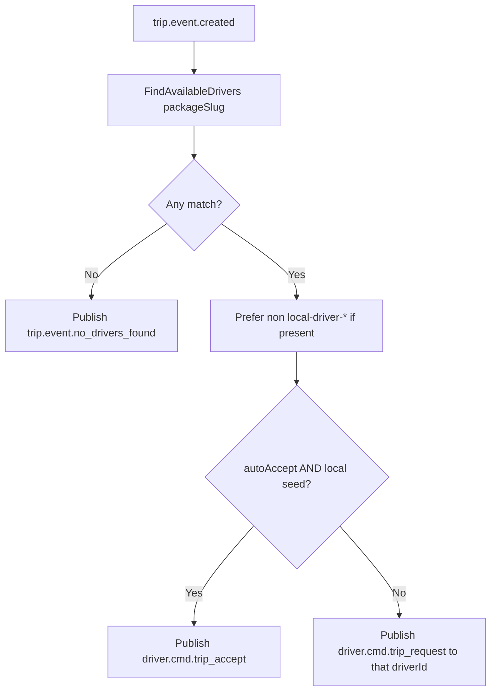

# Service: Driver Service

**Path:** `services/driver-service/`  
**Language:** Go  
**Role:** Driver registry (PostgreSQL-backed) and trip matching by vehicle package, with Redis location tracking.

---

## 1. Responsibilities

- **Register / unregister** drivers (called by api-gateway when a driver WS connects/disconnects).
- On `trip.event.created` (and rematch), **find drivers** with matching `packageSlug`.
- Notify a chosen driver via `driver.cmd.trip_request`, **or** auto-accept seeded local drivers.
- **Persist drivers in PostgreSQL** (`DATABASE_URL`, table `drivers`) — registrations survive restarts; loaded into memory at startup. Falls back to in-memory only if unset/unreachable.
- **Track locations in Redis** (`REDIS_URL`) — writes each driver's position to a GEO set (`drivers:locations`) and hash (`driver:location:<id>`) on registration.

---

## 2. Runtime

| Setting | Value |
|---------|-------|
| Protocol | gRPC `:9092` |
| Storage | PostgreSQL `drivers` table + in-memory cache (`[]*driverInMap`) |
| Tracking | Redis GEO set `drivers:locations` |
| Messaging | Consumes `find_available_drivers` |

### Environment variables

| Variable | Purpose |
|----------|---------|
| `RABBITMQ_URI` | Event bus |
| `DATABASE_URL` | PostgreSQL driver registry (Terraform RDS / compose `postgres`) |
| `REDIS_URL` | Redis location tracking (Terraform ElastiCache / compose `redis`) |
| `JAEGER_ENDPOINT` | Tracing |
| `ENVIRONMENT` | Trace env |
| `LOCAL_SEED_DRIVERS` | Seed one driver per package at boot |
| `LOCAL_AUTO_ACCEPT` | Auto-publish accept for `local-driver-*` IDs |

Compose defaults both local flags to `true`.

---

## 3. gRPC API (`proto/driver.proto`)

| RPC | Behavior |
|-----|----------|
| `RegisterDriver` | Create in-memory driver (random plate, avatar, route start) |
| `UnregisterDriver` | Remove from slice |

Handler: `gprc_handler.go` (filename spelling as in repo).

---

## 4. Matching algorithm



Implementation: `trip_consumer.go` + `service.go`.

### Seeded drivers

When `LOCAL_SEED_DRIVERS=true`:

| Driver ID | Package |
|-----------|---------|
| `local-driver-sedan` | sedan |
| `local-driver-suv` | suv |
| `local-driver-van` | van |
| `local-driver-luxury` | luxury |

IDs are detected with `IsLocalSeededDriver` (`strings.HasPrefix(..., "local-driver-")`).

---

## 5. Driver profile fields

Assigned at register time:

- `Id`, `Name` (fixed demo name), `PackageSlug`
- `CarPlate`, `ProfilePicture` (random avatar URL)
- `Location` + `Geohash` from a predefined SF-area route sample

---

## 6. Key files

```
services/driver-service/
  main.go
  service.go          # registry, seed, find
  trip_consumer.go    # match + notify / auto-accept
  gprc_handler.go
  utils.go            # plates, routes
```

---

## 7. Failure modes

| Scenario | Behavior |
|----------|----------|
| Zero matching package | Rider gets `no_drivers_found` |
| Process restart | Registrations reloaded from PostgreSQL (in-memory only if `DATABASE_URL` unset) |
| Live + seeded both present | Live (browser) driver preferred |

---

## 8. Data stores (live)

- Drivers persisted in **PostgreSQL** (`drivers` table; Terraform RDS in AWS, `postgres` container locally).
- Locations published to **Redis** GEO set for tracking / nearby-driver queries (Terraform ElastiCache in AWS).
- api-gateway also writes live `driver.cmd.location` WS updates to the same Redis keys.

---

## 9. Related docs

- [API Gateway WS](./api-gateway.md)
- [Simulation](../simulation/local-e2e-test.md)
