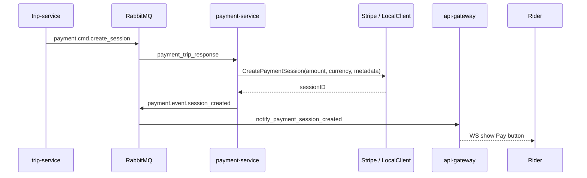

# Service: Payment Service

**Path:** `services/payment-service/`  
**Language:** Go  
**Role:** Create payment sessions after a driver accepts a trip.

---

## 1. Responsibilities

- Consume `payment.cmd.create_session` from queue `payment_trip_response`.
- Create a Stripe Checkout Session **or** a local mock session ID.
- Publish `payment.event.session_created` for the rider UI.
- Does **not** expose a running gRPC server today (`GRPC_ADDR` is unused).

Actual card capture happens in Stripe Checkout (or is simulated locally). Final trip update is driven by api-gateway webhook → `payment.event.success` → trip-service.

---

## 2. Runtime

| Setting | Value |
|---------|-------|
| Entry | `cmd/main.go` |
| Protocol | RabbitMQ consumer only |
| Processors | `infrastructure/stripe` real + `local.go` mock |

### Environment variables

| Variable | Purpose |
|----------|---------|
| `RABBITMQ_URI` | Event bus |
| `STRIPE_SECRET_KEY` | Required; placeholders enable mock |
| `APP_URL` | Base for success/cancel URLs |
| `STRIPE_SUCCESS_URL` | Override success redirect |
| `STRIPE_CANCEL_URL` | Override cancel redirect |
| `JAEGER_ENDPOINT` | Tracing |
| `ENVIRONMENT` | Trace env |

Mock detection: `stripe.IsLocalStripeKey` — empty, contains `replace_me`, or prefix `sk_test_local`.

---

## 3. Flow



Service method: `paymentService.CreatePaymentSession` builds metadata (`trip_id`, `user_id`, `driver_id`) and returns `PaymentIntent` with `StripeSessionID`.

Amount handling: command carries fare as float (cents-like from trip); UI amount = `amount/100` dollars in the published session event.

---

## 4. Local mock sessions

`NewLocalClient` returns IDs like:

```
cs_test_local_<uuid>
```

Frontend `StripePaymentButton` detects this prefix and redirects to `/?payment=success` instead of Stripe.js Checkout.

---

## 5. Key files

```
services/payment-service/
  cmd/main.go
  internal/
    domain/domain.go       # Service + PaymentProcessor interfaces
    service/service.go
    events/trip_consumer.go
    infrastructure/stripe/
      stripe.go            # real Checkout Session
      local.go             # mock processor
  pkg/types/               # PaymentIntent, PaymentConfig
```

---

## 6. Failure modes

| Scenario | Behavior |
|----------|----------|
| Empty `STRIPE_SECRET_KEY` | Fatal on startup |
| Invalid real Stripe key | Session create fails; message may retry / DLX |
| Webhook not configured (local) | Trip may stay `accepted` unless UI/local path used |

---

## 7. Related docs

- [API Gateway webhook](./api-gateway.md)
- [Trip payment consumer](./trip-service.md)
- [Web payment UI](./web.md)
