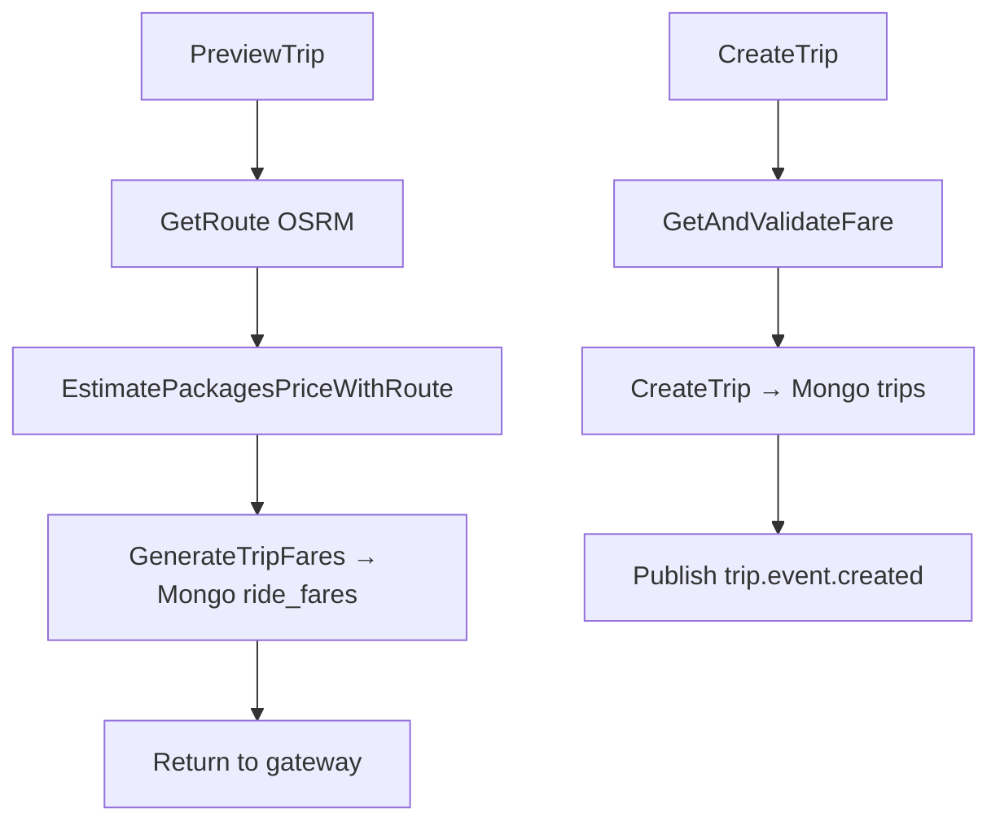

# Service: Trip Service

**Path:** `services/trip-service/`  
**Language:** Go  
**Role:** Trip domain — routing, fares, persistence, assignment updates, payment completion.

---

## 1. Responsibilities

- **PreviewTrip** — call OSRM, price packages, persist temporary `ride_fares`.
- **CreateTrip** — validate fare, insert trip (`pending`), publish `trip.event.created`.
- Consume driver accept/decline → update trip → publish assign / rematch / payment command.
- Consume `payment.event.success` → mark trip `payed`.

Clean-architecture layout (domain / service / repository / infrastructure). See `services/trip-service/README.md`.

---

## 2. Runtime

| Setting | Value |
|---------|-------|
| Protocol | gRPC on `:9093` |
| Database | MongoDB (`ride-sharing` DB) |
| Collections | `trips`, `ride_fares` (`shared/db/mongodb.go`) |

### Environment variables

| Variable | Purpose |
|----------|---------|
| `MONGODB_URI` | Required — empty → fatal |
| `RABBITMQ_URI` | Event bus |
| `OSRM_API` | Base URL (default public OSRM) |
| `JAEGER_ENDPOINT` | Tracing |
| `ENVIRONMENT` | Trace env |

---

## 3. gRPC API (`proto/trip.proto`)

| RPC | Behavior |
|-----|----------|
| `PreviewTrip` | Build route → estimate package prices → store fares → return preview |
| `CreateTrip` | Load fare by ID → create trip document → `PublishTripCreated` |

Entry: `internal/infrastructure/grpc/grpc_handler.go`.

---

## 4. Domain flow



### Trip statuses (typical)

| Status | When |
|--------|------|
| `pending` | Just created, awaiting driver |
| `accepted` | Driver assigned |
| `payed` | Stripe/local payment success processed |

---

## 5. RabbitMQ consumers

| Queue | Handler | Result |
|-------|---------|--------|
| `driver_trip_response` | `driver_consumer` | Accept → assign + `payment.cmd.create_session`; Decline → `trip.event.driver_not_interested` |
| `payment_success` | `payment_consumer` | Update trip paid |

Publisher: `internal/infrastructure/events/trip_publisher.go`.

---

## 6. OSRM integration

`service.GetRoute` builds:

```
{OSRM_API}/route/v1/driving/{lon1},{lat1};{lon2},{lat2}?overview=full&geometries=geojson
```

Coordinates in Mongo / protobuf use lat/lon objects; OSRM expects lon,lat order in the URL.

If OSRM is down, preview fails — compose uses `https://router.project-osrm.org` by default.

---

## 7. Key packages

```
services/trip-service/
  cmd/main.go
  internal/
    domain/           # interfaces & models
    service/          # business logic
    repository/       # mongodb.go (+ optional inmem)
    infrastructure/
      grpc/
      events/         # publisher + consumers
      http/           # OSRM helper bits
```

---

## 8. Failure modes

| Scenario | Behavior |
|----------|----------|
| Invalid / expired fare ID | CreateTrip fails |
| No Mongo | Startup fatal |
| Driver decline | Rematch via `trip.event.driver_not_interested` |
| Payment success without trip | Consumer logs error |

---

## 9. Related docs

- [Driver service](./driver-service.md) — who consumes `trip.event.created`
- [Payment service](./payment-service.md) — who consumes create-session
- [Data flow](../architecture/data-flow.md)
