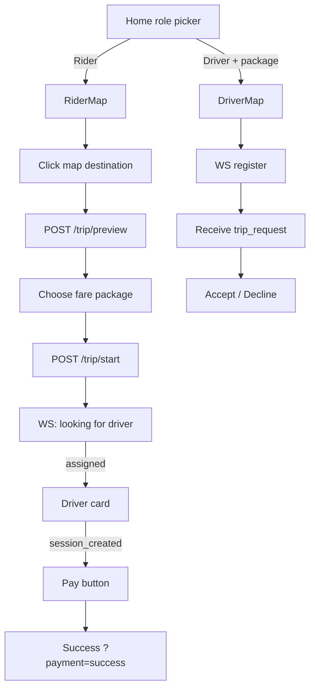

# Service: Web (Frontend)

**Path:** `web/`  
**Language:** TypeScript / Next.js 15 / React 19  
**Role:** Rider and driver experiences — maps, fare selection, live trip status, payment CTA.

---

## 1. Responsibilities

- Role picker: **Rider** vs **Driver** (+ package for drivers).
- Leaflet map: set destination (rider) / show trip (both).
- Call gateway REST for preview & start.
- Maintain WebSockets for live events.
- Render payment button when `payment.event.session_created` arrives.

---

## 2. Runtime

| Setting | Value |
|---------|-------|
| Port | `3000` |
| Framework | Next.js App Router (`src/app/`) |
| Maps | Leaflet + react-leaflet |
| Payments | `@stripe/stripe-js` |

### Build-time env (`NEXT_PUBLIC_*`)

| Variable | Default / prod |
|----------|----------------|
| `NEXT_PUBLIC_API_URL` | `http://localhost:8080` (compose) / `https://api.cloudpulse.live` |
| `NEXT_PUBLIC_WEBSOCKET_URL` | `ws://localhost:8080/ws` / `wss://api.cloudpulse.live/ws` |
| `NEXT_PUBLIC_STRIPE_PUBLISHABLE_KEY` | Optional; local pay works without real key |

These are baked at `next build` — CI passes CloudPulse hosts when building the Docker image.

---

## 3. Screen flow

---

## 4. Key modules

| Path | Role |
|------|------|
| `src/app/page.tsx` | Role switch, payment success screen |
| `src/constants.ts` | API / WS base URLs |
| `src/contracts.ts` | Endpoints + `TripEvents` + type guards |
| `src/hooks/useRiderStreamConnection.ts` | Rider WS state machine |
| `src/hooks/useDriverStreamConnection.ts` | Driver WS + send accept/decline |
| `src/components/RiderMap.tsx` | Map + trip overview |
| `src/components/DriverMap.tsx` | Driver map + accept UI |
| `src/components/RiderTripOverview.tsx` | Status panels (matching, assigned, pay, no drivers) |
| `src/components/StripePaymentButton.tsx` | Stripe redirect or local success |
| `src/components/DriverCard.tsx` | Assigned driver summary |

---

## 5. WebSocket event handling (rider)

| Event (`TripEvents`) | UI effect |
|----------------------|-----------|
| `trip.event.created` | “Looking for a driver” |
| `trip.event.no_drivers_found` | Error panel + go back |
| `trip.event.driver_assigned` | Show driver / waiting payment |
| `payment.event.session_created` | Payment Required + Pay button |

Driver side listens for `driver.cmd.trip_request` and `driver.cmd.register`.

---

## 6. REST payloads

Aligned with `web/src/contracts.ts`:

- Preview: `{ userID, pickup, destination }`
- Start: `{ rideFareID, userID }`

`user.randomUUID()` generates per-tab user IDs so WS `ownerId` routing works.

---

## 7. Docker

`web/Dockerfile` — multi-stage `npm ci` → `next build` → `npm start`.  
Compose build-args point API/WS at `localhost:8080` for browser access.

---

## 8. Related docs

- [API Gateway](./api-gateway.md)
- [Local E2E simulation](../simulation/local-e2e-test.md)
