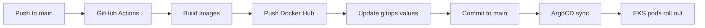

# CloudPulse CI / GitOps



## What this does

1. **CI** (`.github/workflows/ci-cd.yaml`) builds changed images and pushes them to **Docker Hub**.
2. CI updates `gitops/cloudpulse/values-production.yaml` with the new image tag (git SHA).
3. **ArgoCD** watches that file + the Helm chart and deploys to the EKS cluster.

| Image | Dockerfile | Docker Hub name |
|-------|------------|-----------------|
| Go API Gateway | `./Dockerfile` (`SERVICE=api-gateway`) | `<user>/cloudpulse-api-gateway` |
| React frontend | `./web/Dockerfile` | `<user>/cloudpulse-web` |

## GitHub secrets

Add these under **Settings → Secrets and variables → Actions**:

| Secret | Purpose |
|--------|---------|
| `DOCKERHUB_USERNAME` | Docker Hub username / org |
| `DOCKERHUB_TOKEN` | Docker Hub access token ([create one](https://hub.docker.com/settings/security)) |
| `NEXT_PUBLIC_STRIPE_PUBLISHABLE_KEY` | Optional; baked into the web image at build time |

`GITHUB_TOKEN` is provided automatically (used to commit GitOps tag bumps).

## Bootstrap ArgoCD (once)

```bash
# Install ArgoCD
kubectl create namespace argocd
kubectl apply -n argocd -f https://raw.githubusercontent.com/argoproj/argo-cd/stable/manifests/install.yaml

# Wait for pods
kubectl -n argocd rollout status deployment/argocd-server

# Register the CloudPulse app
kubectl apply -f gitops/argocd/application-project.yaml
kubectl apply -f gitops/argocd/application.yaml
```

If the GitHub repo is private, add a repo credential in ArgoCD (UI or CLI) before the Application can sync.

## First-time values check

Edit `gitops/cloudpulse/values-production.yaml` (or wait for CI) so repositories match your Docker Hub user:

```yaml
backend:
  image:
    repository: YOUR_DOCKERHUB_USER/cloudpulse-api-gateway
frontend:
  image:
    repository: YOUR_DOCKERHUB_USER/cloudpulse-web
```

Also set the ALB ACM certificate annotation when ready.

## Verify the loop

```bash
# Trigger a build manually
# GitHub → Actions → "Build, Push Docker Hub & GitOps" → Run workflow

# Watch ArgoCD
kubectl -n argocd get application cloudpulse
argocd app get cloudpulse   # if CLI installed

# Watch rollout
kubectl -n cloudpulse get pods -w
kubectl -n cloudpulse describe deploy
```

## Path filters

| Change under… | Rebuilds |
|---------------|----------|
| `services/`, `shared/`, `Dockerfile`, `go.*` | Backend |
| `web/` | Frontend |
| Manual `workflow_dispatch` | Either / both |

GitOps commits only touch `gitops/cloudpulse/values-production.yaml` so they do not recursively rebuild images.
